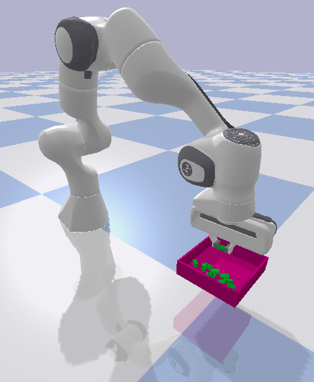
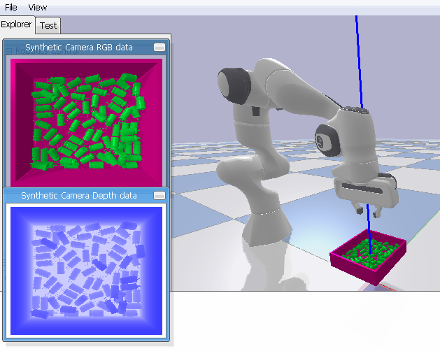

# Robotic Manipulation Simulator
The Robotic Manipulation Simulator is a toolkit aimed at facilitating the efficient development of machine learning
algorithms. The long term goal is to provide researchers with the support and configurability to train multiple types of
robots on different peg-in-hole / bin picking scenarios, in a highly configurable and easy-to-use environment that is capable of a
high degree of randomization.   

TODO: complete the documentation.

## Project Installation
There are two options for installing this project: a docker method and a source method. Note that you must perform
the source installation if you wish to run the simulator on your host os. An efficient development method is to edit
the source code on your host os and then enter the docker container and run your code there. Both methods work reliably
on ubuntu 18.04 LTS.

> For both methods you will have to clone the project repo

`git clone ...`

### Source Method
> Navigate into robotic-manipulation project app directory

`cd <project>/app/`

> Install all minimum project requirements

`pip install -r requirements.txt` or `pip3 install -r requirements.txt` depending on your setup
 
> Install python package and dependencies for project

`pip install -e .` or `pip3 install -e .` depending on your setup

> Change the access permissions of the script that runs all the tests so that it can be executed

`chmod +x run_all_tests.sh`

> Run the provided tests and verify they are passing

`./run_all_tests.sh`

### Docker Method
Note:
*  Both headless mode and gui mode have corresponding containers and both use the same image `huawei/pineapple:latest`. The containers are run from different scripts (i.e. the `run_headless_container.sh` and the `run_gui_container.sh` for the headless and gui container, respectively)
*  Any change made to any of the files in the `<project>/app/` directory from within the docker container will also be applied to the host's `<project>/app/` directory and vice versa
*  Vim is included in the docker so there is a means of writing and changing code, etc.
*  If you are using the simulator somewhere outside of Canada you will have to change the relevant code in `<project>/dockerize/Dockerfile` and update the proxy certificates in `<project>/dockerize/certs/`
*  To remove an existing robotic-manipulation simulator image and container (i.e. if you want to build and run a fresh docker image and container), navigate to the `<project>/dockerize/` directory and run `make clean_gui` or `make clean_headless` to remove the `gui_pineapple` or `headless_pineapple` container and the `huawei/pineapple:latest` image (in both cases). 

> Use `docker --version` to ensure you have docker version>=19.03 installed. If not, dowload the docker engine
> for your os [here](https://docs.docker.com/install/).

> Navigate into robotic-manipulation dockerize directory

`cd <project>/dockerize/`

> Change the access permissions of the scripts that run and enter the docker container so they can be executed

`chmod +x run_headless_container.sh run_gui_container.sh enter_container.sh`

> Build the docker image and run the container for the desired mode using the Makefile

`make gui` or `make headless`

> Run the script to the docker container and enter the number corresponding to the container of interest and then Y or y when prompted to verify that the desired container is up

`./enter_container.sh`

> If the `huawei/pineapple:latest` image is already created and you want to run a container for another mode, all you have to do is navigate to the `<project>/dockerize/` folder and run the run script corresponding to the desired mode  

## Optimizing Simulator Performance
> There are a few configurations that can be set in order to optimize the performance of the simulator, these are found in the config file of a given env:
*  Reduce the number of objects in the simulator. The simulator will be significantly faster when fewer objects are being simulated. This is done by reducing both the `min-number-of-objects` and `max-number-of-objects` options in the scene > bin > objects section of the relevant config file.
    *  With fewer objects in the simulation, you may also reduce the `steps-for-objects-to-fall` option proportionally in the scene section of the relevant config file.
*  Use a simpler object type. The simulator will be faster when a simpler object type is used as the physics calculations become simpler. This is done by setting the `load-specific-object` to True and then setting the `relative-path-to-object` option as one of the supported simple objects (see below) in the scene > bin > objects section of the relevant config file.
    *  Supported simple objects:
        *  sphere
        *  cylinder
*  Render rgb and depth images of the environment as little as possible. If these images are not needed, set the `render-mode` option to human in the simulation section of the relevant config file. Note, the human render mode must be supported by the environment of interest and if it is not just set the render-mode option to a valid mode and avoid calling render on the environment as much as possible. 

## Interfacing with Gym
> Stable provided franka gym environments - see the documentation for more info on a specific environment:
*  franka-v0
*  franka-v1
*  franka-v2
*  pineapple-v0

#### To implement your own script which interfaces with a provided Franka Emika Gym environment:
> Create a python source code file in gym_env/examples

> Import gym and gym_env

`import gym`

`import gym_env`

> Construct an instance of the environment (note you may replace default.yaml with whatever config file you want to use,
> however it must follow the structure outlined in the docs/Configuration_File_Docs.md document)

`env = gym.make([environment name], config_file=os.environ['env_path'] + '/configs/default.yaml)`

> Reset the environment - this will return an initial observation

`observation = env.reset()`

> Enter a continuous loop (or one that terminates when a terminating condition is met)

> Each iteration call render(), get an action from the environment's action space, step(action), and/or reset() based on
> your desired functionality. See the section of the [documentation](docs/Robotic_Manipulation_Simulator_Doc.pdf)
> that applies to the provided gym environment that you are using for more detailed information on the exact parameters
> and return values for the mentioned functions. Also see the section of the documentation related to FrankaArm to gain
> a stronger understanding of the provided functionality.

> Note that just sampling actions from the action space will cause very erratic behaviour in an untrained arm

    while not done:
        action = env.action_space.sample()
        observation, reward, done, info = env.step(action)
    env.close()

> Set the desired configuration for the simulator in gym_env/configs/default.yaml (best to leave everything default if
> this is your first time using the simulator). See the docs/Configuration File markdown document for more detailed information.

> Navigate into the examples directory

`cd <project>/app/gym_env/examples/`

> Run the simulation (where file_name is the name of the file including your implementation)

`python3 file_name` or `python file_name` depending on your setup

#### Running an example script which interfaces with a provided Franka Emika Gym environment:
> Navigate into robotic-manipulation project directory

`cd <project>`

> Set the desired configuration for the simulator in app/gym_env/configs/default.yaml for franka envs or 
> app/gym_env/configs/pineapple.yaml for pineapple envs (best to leave everything default if
> this is your first time using the simulator). See the docs/Configuration File markdown document for more detailed information.

> Run the simulation

`python gym_env/examples/franka_0_run.py`

> Note that the arm in this example behaves very nicely but does not attempt to grab any of the objects in bin. This is
> because the purpose of this example is more to show the correct structure of a script that interfaces with gym as well
> as the supported capabilities of applying action to the franka robot using inverse kinematics and position control.
> Specifically, this example uses inverse kinematics to calculate the joint poses of the robot such that the end
> effector is in a random position within the scope of the bin.

## Running the Interactive Franka Emika Robot Simulation
> Navigate into robotic-manipulation project app directory

`cd <project>/app/`

> Set the desired configuration for the simulator in gym_env/configs/default.yaml (best to leave everything default if
> this is your first time using the simulator). See the docs/Configuration File markdown document for more detailed information.

> Run the interactive simulation

`python gym_env/examples/interactive_franka.py`

> When the simulation starts up it will print the keys you use to control different aspects of the arms movement to the
> terminal - they are also described below.

> Control the position of the franka arm with:
*  `1` and `2` increase and decrease (respectively) the x position of the arm's end effector
*  `3` and `4` increase and decrease (respectively) the y position of the arm's end effector
*  `5` and `6` increase and decrease (respectively) the z position of the arm's end effector

> Control the orientation of the franka arm with:
*  `7` and `8` increase and decrease (respectively) the zeroth element of the quaternion representing the arms orientation
*  `9` and `0` increase and decrease (respectively) the first element of the quaternion representing the arms orientation
*  `right` and `left` arrow keys increase and decrease (respectively) the second element of the quaternion representing the arms orientation
*  `up` and `down` arrow keys increase and decrease (respectively) the third element of the quaternion representing the arms orientation
 
> Additional functionality:
*  `space` key toggles whether the end effectors are open or closed
*  `r` key resets the environment
*  `esc` exits the interactive section

## Visualizing Render Data
When render is called on the supplied custom gym environments, it is possible to get either the RGB camera data or both the
RGB and depth camera data. Further, the depth data can either be returned pre-scaled (by a factor of 255) or not pre-scaled (as
the true z value depth data) with values between 0 and 1. This can be configured in the camera > scale-depth-data section of
the config file (app/gym_env/configs) and more info can be found in docs/Configuration_File_Docs.md. In order to visualize this
data all you have to do is use the PIL.Image library. In the case of the RGB and pre-scaled depth data all you have to do is
execute the following lines of code,

`rgb_img = Image.fromarray(rgb_data_array, 'RGB')`

`depth_img = Image.fromarray(depth_data_array)`

`rgb_img.save(PATH + '.png')`

`depth_img.save(PATH + '.png')`

In the case of the not pre-scaled depth data, it is best to auto-scale the data using the max possible scale factor such that
the data occupies as much of the range between 0 and 255 as possible. Apply this scale factor to the depth data prior to the
code above. This will make the produced depth image much easier to see than in the case of the pre-scaled depth data. Some
example depth images using auto-scaling can be found in the app/gym_env/sample_pics/ directory (there are also some rgb
images in the folder as well). Refer to app/gym_env/examples/run_franka0env.py for an example implementation of how 
auto-scaling depth data and visualing RGB and depth data can be done. Note in the case of run_franka0env.py the observation
space of franka-v0 is the camera render data (both the rgb and depth data), which is why it uses the components of the 
observation as the rgb and depth data.

## Configuring the Pybullet GUI
> Use the following keys to configure the pybullet gui at any time while it is open and connected:
*  `g` key enables additional gui features including rgb and depth camera previews (env.render('rgb_array) must be called to update the camera previews)
*  `s` key toggles shadows and planar reflection (not visible in wireframe viewing mode)
*  `w` key toggles wireframe viewing mode
*  `c` key toggles showing current collisions (only visible in wireframe viewing mode)
*  `k` key toggles showing axis of freedom of move-able joints (only visible in wireframe viewing mode)
*  `j` key toggles showing axis of orientation of all objects (only visible in wireframe viewing mode)

## Additional Testing Options
> Running the script run_all_tests.sh will run all provided tests for the project. If it is desired to run a different test suite or a more
> specific test suite, see the instructions below

> Navigate into robotic-manipulation app directory

`cd <project>/app/`

`pytest [-v | -vv] [-m MARKERS] tests/`
> The options `-v` and `-vv` can both be used to add verbosity

> To run a desired suite of tests, use the following markers (or none) in different combinations: 
*  `base_functionality`: this marker will run all non franka-v# env specific tests (still runs all tests corresponding to parent classes of Franka#Env)
*  `franka_v0`: runs franka-v0 env specific tests (scope of test suite only covers methods in Franka0Env, no inherited methods are tested with this marker)
*  `franka_v1`: runs franka-v1 env specific tests (scope of test suite only covers methods in Franka1Env, no inherited methods are tested with this marker)

> See below for some example test suites:
*  `pytest tests/`: will run all tests except those corresponding to specific env's that are not an instance of the current working env (since no env is specified the default is a franka-v0 env so tests corresponding to specific franka-v1 or franka-v2 methods will not be run) 
*  `pytest -m "base_functionality or franka_v0" tests/`: will run tests marked with either base_functionality or franka_v0
*  `pytest -m "franka_v1" tests/`: will only run tests specific to franka-v1 env

> Note other variations of markers are also possible and if an invalid combination is passed, an error message will show
> with the rule that has been violated

## Additional Documentation
Navigate into the `<project>/docs` directory and open the desired pdf or markdown document. There is provided
documentation for the following aspects of the project:
*  configuration file info (markdown doc)
*  franka 0 gym environment info (markdown doc)
*  franka 1 gym environment info (markdown doc)
*  creating your own robotic manipulation gym env (markdown doc)
*  robotic manipulation simulator documentation (lower lvl documentation on specific code files) (pdf doc)
